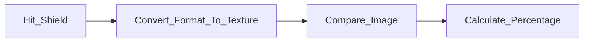

# Projet de peinture en VR - Unity

J'ai réalisé le design d'une carte PCB à base d'Attiny.  
L'ATtiny est une famille de microcontrôleurs fabriquée par la société Microchip Technology. 
Ces petits composants électroniques sont connus pour leur taille compacte, leur faible consommation d'énergie et leurs performances fiables, ce qui les rend idéaux pour une variété d'applications intégrées.

Sur la carte PCB j'ai avons ajouté des connecteurs femelles afin d'utiliser l'ATtiny dans plein de configurations différentes et un connecteur mâle afin de programmer l'ATtiny. 
L'ATiny choisit est le 2313A-PU. C'est une puce traversante qui possède 20 pins avec du SPI, de l'I2C et de l'UART.

*Temps du projet : 2 jours *

# Sommaire des fonctionnalités
- [Les différents outils disponible](#les-différents-outils-disponible)
- [Gestion de la sélection des outils](#gestion-de-la-sélection-des-outils)
- [Mini-jeu](#mini-jeu)
- [Fonctionnalité supplementaire](#fonctionnalité-supplementaire)

## Schéma électronique 
[*(Back to top)*](#sommaire-des-fonctionnalités)

| Démonstration | Explication |
|---------|---------|
|  | L'objectif de la carte était de faire un design le plus petit possible : 17mm x 33 mm. Ceci permet d'avoir un coût pour une carte assez faible : 12 dollars chez PCBWay.Pour programmer la carte ATtiny nous aurons besoin d'une carte Arduino afin d'y installer le bootloader puis le programme dans l'ATtiny.|

## Routage de la Carte PCB
[*(Back to top)*](#sommaire-des-fonctionnalités)

| Démonstration | Explication |
|---------|---------|
|  | La carte PCB est constitué de deux couches Top Layer et Bottom Layer. Nous avons un connecteur mâle en haut de la carte afin de programmer celle-ci. Pour cela on utilise le SPI de la carte ATtiny que l'on reliera au SPI de la carte Arduino. Nous avons ajouté le +5V et le GND afin de facilement alimenter la carte une fois celle-ci programmé.|

## Mini-jeu
[*(Back to top)*](#sommaire-des-fonctionnalités)

Le mini-jeu permet de reproduire le dessin d'un tableau et d'obtenir un score de ressemblance. Pour obtenir ce score, le programme va comparer les 2 textures en calculant la différence de chaque canal de couleur (R, V, B et Alpha) pour chaque pixel, puis en calculant la moyenne de toutes les différences. 

**Fonctionnement général :**

| Démonstration | Explication |
|---------|---------|
|  | **Téléportation** : Sélectionner le rocher magique pour vous téléporter dans l'atelier, ou l'armoire magique pour retourner dans le monde de base.|
|  | **Taille du pinceau** : Peinture, possibilité de changer la taille (avec les pinceau accroché au mur à gauche).|
|  | **Score** : Dessiner une pomme puis sélectionner le bouclier magique pour obtenir votre score de ressemblance en pourcentage. |

## Fonctionnalité supplementaire 
[*(Back to top)*](#sommaire-des-fonctionnalités)

| Démonstration | Explication |
|---------|---------|
|  | **Renard** : Parce que c'est trop mignon !! Regardez le faire ces petites roulades.|

## Groupe

* [Sebila Doubaeva](https://github.com/taredalen)
* [Camille Bayon de Noyer](https://github.com/Kamomille)
* [Maelle Marcelin](https://github.com/maaelle)
* [Monia Moghraoui](https://github.com/SoniaMogh)

## Asset Store

* [Renard](https://assetstore.unity.com/packages/3d/characters/animals/toon-fox-183005)
* [Papillon](https://assetstore.unity.com/packages/3d/characters/animals/insects/butterfly-animated-58355)
* [Atelier du mini jeu](https://assetstore.unity.com/packages/3d/environments/cabin-environment-98014)
* [Village principal](https://assetstore.unity.com/packages/3d/environments/landscapes/rpg-poly-pack-lite-148410)
* [Table pour poser les outils](https://assetstore.unity.com/packages/3d/props/wooden-pbr-table-112005)

[*(Back to top)*](#sommaire-des-fonctionnalités)

