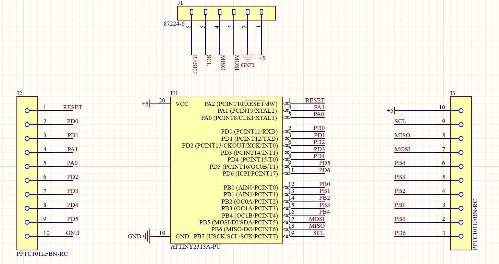
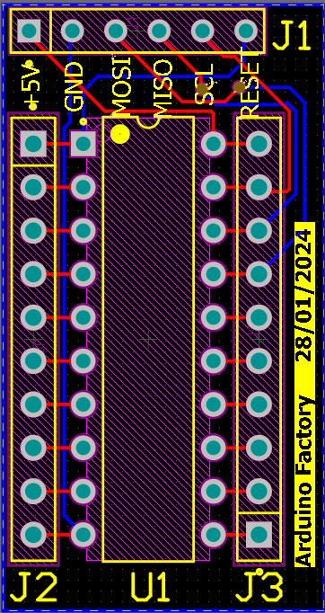
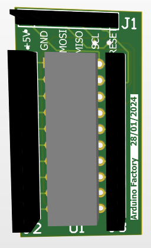

# Projet carte PCB ATtiny

J'ai réalisé le design d'une carte PCB à base d'Attiny.  
L'ATtiny est une famille de microcontrôleurs fabriquée par la société Microchip Technology. 
Ces petits composants électroniques sont connus pour leur taille compacte, leur faible consommation d'énergie et leurs performances fiables, ce qui les rend idéaux pour une variété d'applications intégrées.

Sur la carte PCB j'ai avons ajouté des connecteurs femelles afin d'utiliser l'ATtiny dans plein de configurations différentes et un connecteur mâle afin de programmer l'ATtiny. 
L'ATiny choisit est le 2313A-PU. C'est une puce traversante qui possède 20 pins avec du SPI, de l'I2C et de l'UART.

*Temps du projet : 2 jours *

# Sommaire des fonctionnalités
- [Schéma électronique](#schéma-électronique)
- [Routage de la Carte PCB](#routage-de-la-carte-pcb)
  

## Schéma électronique 

| Démonstration | Explication |
|---------|---------|
|  | L'objectif de la carte était de faire un design le plus petit possible : 17mm x 33 mm. Ceci permet d'avoir un coût pour une carte assez faible : 12 dollars chez PCBWay.Pour programmer la carte ATtiny nous aurons besoin d'une carte Arduino afin d'y installer le bootloader puis le programme dans l'ATtiny.|

## Routage de la Carte PCB

| Démonstration | Explication |
|---------|---------|
|  | La carte PCB est constitué de deux couches Top Layer et Bottom Layer. Nous avons un connecteur mâle en haut de la carte afin de programmer celle-ci. Pour cela on utilise le SPI de la carte ATtiny que l'on reliera au SPI de la carte Arduino. Nous avons ajouté le +5V et le GND afin de facilement alimenter la carte une fois celle-ci programmé.|
|  | j'ai ajouté deux connecteurs femelles de part et d'autres de l'ATtiny afin de facilement relier des composants à celle-ci. |

## Arduino Factory

 * [Plus de détails sur le projet](https://arduinofactory.fr/carte-pcb-attiny/)
  

